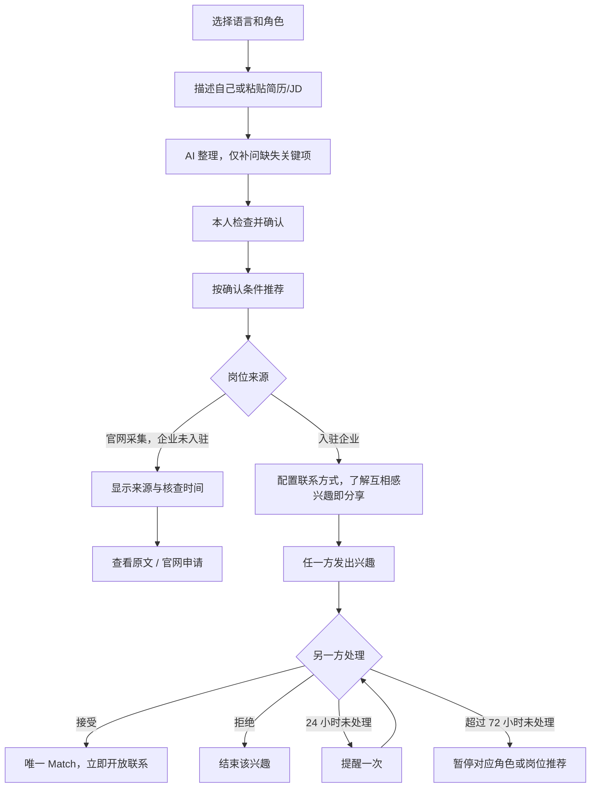

# JobTinder V0.1 Telegram Bot 交互流程

修订日期：2026-09-21｜状态：待实现的设计稿，尚未运行验收

关联：[产品定义](JobTinder-V0.1-产品定义.md)。[修订前流程](archive/before-2026-09-21-revision/JobTinder-V0.1-Telegram-Bot交互流程.md)仅作历史参考。本稿中的企业、人物和卡片均为虚构演示。中文为评审文案，高棉语/英语上线文案需人工审校。JobTinder 为内部代号。

## 1. 总流程与导航

入口：`/start` 恢复进度，`/menu` 返回首页，`/profile` 编辑资料，`/matches` 查看匹配，`/settings` 设置，`/help` 帮助，`/cancel` 退出当前编辑，`/delete` 进入删除确认。

- 资料和联系方式只在私聊展示；群内入口引导到 Bot 私聊。
- 求职和招聘角色分别保存草稿，切换不覆盖资料；再次启动不清空进度。
- 每一步提供返回、修改、保存稍后继续；已提取内容不再逐项重复询问。
- 草稿和已发布版本分开。按钮绑定具体岗位、候选人和版本；回调重新核验权限。
- 全部功能免费，不出现充值、会员、付费加速或解锁联系。

## 2. 求职者建档 C

### C01 开始

“你想找什么工作？说说你会做什么、做过什么，也可以直接粘贴已有简历。”

按钮：`描述自己` / `粘贴简历` / `手动填写` / `稍后继续`。

首版不把文件上传、语音识别写成已经可用；后续能力就绪再增加入口。

### C02 AI 整理与补问

草稿示例：

> 想找：仓库理货、库存助理
> 技能：盘点、Excel 录入
> 做过：收货清点、库存登记
> 行业：零售；也接受其他行业
> 未说明：可工作地区

先补问影响当前匹配的关键缺项，例如“你可以在哪些地区工作？”不要依次强制询问全部工资、语言、班次和证书字段。

用户可将具体偏好设为 `必须满足` / `优先考虑` / `没有要求`。AI 不把所有行业偏好都设为必须；用户明确“无经验”可继续。

### C03 本人确认

“这是根据你提供的信息整理的求职卡，请检查。未填写的内容不会被当成已经满足。”

按钮：`确认并找工作` / `修改内容` / `调整必须条件` / `保存草稿`。

确认前展示资料可见范围：默认仅向本人表达兴趣的企业展示，用户也可选择允许已入驻企业主动推荐。不得默认把完整简历向所有企业公开。联系方式仍单独保存，卡片不公开展示。

### C04 推荐与缺项

已满足硬条件的卡片显示具体匹配理由，例如“你确认的盘点经验符合岗位必需项”。非必须信息缺失显示“未提供”；官网未公开薪资时，薪酬统一显示“面议”，附注“官网未公开薪资”，不编造薪资或百分比。

明确冲突不展示。硬条件缺失进入待补充，不混入“符合条件”卡片；官网未公开薪资是展示例外，不单因薪资未知隐藏，即使用户设置了期望薪资也可展示，但不能标为薪资已符合。暂无合适库存时显示：`调整条件` / `有合适岗位时通知我` / `暂停求职`，不自动放宽其他条件。

## 3. 官网采集岗位 O

### O01 卡片

> 库存助理 · 示例企业（演示）
> 工作内容：库存登记、收货核对
> 来源：企业官网 · 企业未入驻
> 薪酬：面议
> 薪酬说明：官网未公开薪资
> 最后核查：显示实际成功核查时间
> 原始发布日期：未提供则明确标注
> 提示：在企业官网申请，平台无法确认企业回复进度。

按钮：`查看原文` / `前往官网申请` / `跳过` / `信息有误或已失效`。

此卡不能显示“企业对你感兴趣”“等待企业接受”或站内 Match。申请入口必须来自已核对的官方来源；未找到有效入口则待复核，不展示无效申请按钮。

### O02 跳转

“将打开企业的官方申请页面，后续申请由该页面完成。平台不会自动发送你的求职资料。”

用户主动点击后跳转。记录能实际观测到的入口动作，不能将普通链接展示当作点击，更不能将点击当成已投递。

### O03 失效与认领

来源明确已关闭时停止推荐；旧卡提示“该岗位已结束，查看其他岗位”。抓取异常显示待复核，不称企业已招满。

企业认领后核对负责人权限，确认当前职责与条件，才转换为入驻岗位。用户之前打开过官网不等于已表达站内兴趣。

## 4. 企业入驻与发岗 E

### E01 企业与负责人

填写/确认企业名称、官网、负责人联系信息及代表该企业的依据。仅做已实际具备证据的核对，不因有官网链接就给该账号管理权。

入口：`整理一份招聘说明` / `认领官网已有岗位`。认领未完成时保留官网来源状态，不接收候选人私密信息。

### E02 AI 整理 JD

“粘贴已有招聘说明，或直接说你需要谁、做什么。”

AI 预填岗位、行业、工作内容、必需技能与加分项；招聘方重点检查这些字段。已提取信息不用重填。薪资等未提供则标记未知，不自行补全。

按钮：`确认发布` / `修改要求` / `调整必需与加分项` / `保存草稿`。

发布不等于平台保证真实；显示“招聘方确认”和确认日期。已有官网岗位须保留原始来源和去重关系。

### E03 候选卡

先选择具体有效岗位，再查看允许向该企业展示且通过硬条件的候选人。

展示：目标岗位、候选人确认的技能/任务经验、相关理由及未提供的信息。按钮：`感兴趣并邀请` / `暂不合适` / `举报或屏蔽`。

不把对一个岗位的兴趣扩散到企业其他岗位。负责人更换、权限撤销后，旧按钮不能继续访问资料。

### E04 招聘状态

岗位管理：`修改` / `暂停招聘` / `已招满` / `恢复招聘`。

招满即时停止新推荐，已有联系保留历史及关闭提示。恢复时重新确认条件、人数与有效期；不自动复活旧版兴趣。

## 5. 双向兴趣与立即联系 M

### M01 发出兴趣前的联系设置

首次发送兴趣，或联系方式改变时：

> 你选择向匹配对象提供：当前选定的 Telegram 联系方式/业务邮箱/电话。
> 对方也对这个岗位下的匹配感兴趣后，你们将立即看到彼此选定的联系方式。

按钮：`确认并发送兴趣` / `修改联系方式` / `返回`。

后续兴趣按钮旁持续提示互相感兴趣即开放联系方式，不逐次添加额外表单。没有可用联系方法先设置；拒绝分享仍能浏览。不能在未告知情况下读取或分享电话号码。

### M02 收到兴趣

求职者收到：“示例企业对你应聘的库存助理岗位感兴趣。”

企业收到：“有一位候选人对你的库存助理岗位感兴趣。”

均提供：`查看资料并接受` / `不合适` / `稍后处理`。接受前展示当前资料、岗位及分享规则；若接收方未配置联系方式，在这一步完成，然后一次接受即可建立 Match。

“稍后处理”不重置计时。拒绝结束该条兴趣，不向发起方披露私人拒绝理由；同版本已拒绝组合不重复骚扰。

### M03 立即开放联系

双方当前版本兴趣有效时，立刻创建唯一 Match，并在双方匹配列表开放联系方式：

> 你们已互相感兴趣。
> 岗位：库存助理
> 联系方式：对方主动选定的联系方法

按钮：`联系对方` / `查看岗位` / `联系方式有问题` / `屏蔽或举报`。

**Match 后不再出现“同意交换联系方式”步骤，也不等待运营批准。** 通知通过队列发送，失败则提示实际状态；不能把通知投递成功算作双方已聊天。

用户无 Telegram username 时，可自行设置或选择其他联系方法。手填邮箱/电话若未经核验，不能标成已验证。

### M04 资料变化与撤回

- 匹配前撤回兴趣即停止该次分享；未提供双向兴趣不得开放联系方式。
- 关键条件变化导致旧兴趣失效；旧卡按钮提示查看新版并重新表达兴趣。
- 已开放联系后不能保证对方忘记或删除联系方式；可停止平台内新触达并更新联系方法。
- 后续面试、录用反馈自愿填写，不阻止继续使用，不强制跟踪站外谈话。

## 6. 24 小时提醒、超过 72 小时暂停 N

### N01 计时起点

仅对入驻双方的待处理兴趣计时：成功通知且收件箱可见时开始；若通知未成功但用户实际打开该待处理项，以可记录的查看时间开始。不能用官网采集时间或用户最后上线时间替代。

发送失败/状态不明保留异常记录，不因系统故障处罚用户。通知成功不等于已读，文案称“已发送”而非“你已读”。

### N02 满 24 小时

“你有一条兴趣尚未处理。请接受或选择不合适；超过 72 小时未处理，会暂停相关推荐。”

按钮：`现在处理` / `已找到工作或已招满`。

同一条兴趣只发一次 24 小时提醒。接受和拒绝均算处理，查看或点击稍后不算。

### N03 超过 72 小时

求职者：“你有超过 72 小时未处理的兴趣，已暂停向你推荐新岗位及向企业推荐你。可处理后恢复，或结束求职。”

招聘方：“这个岗位有超过 72 小时未处理的兴趣，已暂停该岗位的新推荐与新兴趣接收。”

按钮：`处理待办并恢复` / `结束求职或关闭岗位`。

默认不因某岗位超时而关闭同一企业其他正常岗位；不删除既有 Match 或已开放的联系记录。暂停范围与产品定义一致。

### N04 恢复

进入待办逐条接受/拒绝超时兴趣；接受可与“确认仍在求职/招聘并恢复”合并完成。只有所有超时待办已处理、状态重新确认且其他条件仍有效，才恢复推荐及完成新 Match；不靠登录自动恢复。

用户可选择直接结束求职/关闭岗位，无须先完成所有待办。计时任务处理前复查当前状态，避免刚回复又被暂停。

### N05 规则边界

官网申请不计时；双方已经开放联系后的私聊不计时。平台不读取私聊、不承诺对方一定回复，也不以私聊未回复为由自动处罚。

## 7. 暂停、退出、举报与删除 P

首页常驻：`暂停` / `已找到工作`（招聘端为 `已招满`）/ `修改资料`。

暂停立即停止对应推荐；已有联系仍可查看。找到工作关闭求职状态，不影响同一账号的招聘角色。招满只关闭对应岗位。

举报卡片可选：来源有误、岗位已失效、条件不实、收费要求、骚扰。严重线索先隐藏再处理；平台拉黑停止新推荐、新兴趣与新的联系释放，不代表对方已被个人 Telegram 账号拉黑。

删除先确认范围，再立即退出推荐并取消未完成分享/通知，后台执行数据清理。清理结果与实际状态一致；不承诺删除对方已保存的信息。

## 8. 状态、一致性与异常

| 对象 | 主要状态 |
|---|---|
| 求职卡 | draft / active / paused / stopped / deleted，暂停另存原因 |
| 官网岗位 | discovered / active_external / needs_review / closed，原始来源一直保留 |
| 入驻岗位 | draft / active / paused / closed，权限与版本独立校验 |
| 兴趣 | pending / accepted / declined / withdrawn / invalidated，计时字段独立保存 |
| Match | contact_available / needs_reconfirmation / ended / blocked；通知送达另记 |
| 通知 | queued / sent / failed / delivery_unknown |

Match 一经创建即 contact_available，不以通知是否送达为联系开放门槛。创建事务须同时校验有效双向兴趣、当前版本、双方分享告知与联系方式、角色权限和屏蔽状态。

| 异常 | 处理 |
|---|---|
| AI 失败 | 保存草稿，手动继续；不被迟到结果覆盖 |
| 重复点击/双方并发接受 | 返回同一 Match，单侧兴趣和组合有唯一约束 |
| 旧岗位/旧联系方式按钮 | 拒绝旧动作，展示当前版本供确认 |
| 没有合适库存 | 如实显示为空，不偷偷放宽硬条件 |
| 官网请求失败或解析结构变化 | 待复核，不假称招满；按来源新鲜度规则暂停 |
| 通知被屏蔽、限流或超时 | 区分失败与不确定，有限重试，保留待处理项；不启动无证据的未回复处罚 |
| 未授权企业访问候选人 | 拒绝，不能通过修改 token 获取其他企业资料 |
| 来源岗位被认领 | 核对权限、确认条件；旧跳转记录不转换为兴趣 |
| 用户关闭、拉黑、删除与异步任务并发 | 执行前复查状态，停止新的触达与联系释放 |

## 9. 待执行验收

1. 求职者文字建档 → AI 草稿 → 修改确认，未提供内容保持未知；中断后可续填。
2. 官网岗位 → 来源、核查时间、原文 → 官网申请；无虚假双向兴趣或等待回复倒计时。
3. 入驻岗位双方任一方先发兴趣 → 对方接受 → 一个 Match，立即看到选定联系方式。
4. 分享规则在发兴趣前清楚展示；单方兴趣无私密联系方式；无用户名时可选备用方式。
5. 24 小时提醒一次，超过 72 小时暂停准确对象；通知失败不误罚，回复与超时并发不误暂停。
6. 处理超时待办且重新确认后恢复；招满/找到工作可直接关闭；旧兴趣不自动复活。
7. 硬条件冲突隐藏、必需信息未知待补；官网薪资未公开时照常展示“面议”和来源说明，不当作已满足薪资要求；非必须未知可显示。同义词、否定句正确处理。
8. 旧版本、跨企业访问、角色切换、重复按钮、删除/拉黑队列均不能绕过权限。
9. 任一路径均无付款、付费解锁或佣金；面试/入职反馈可跳过。

这份流程尚未实现。将来验收须覆盖真实 Telegram 两方账号、数据库记录、采集来源变更与通知故障；仅文档或 Bot 启动成功不代表闭环完成。
