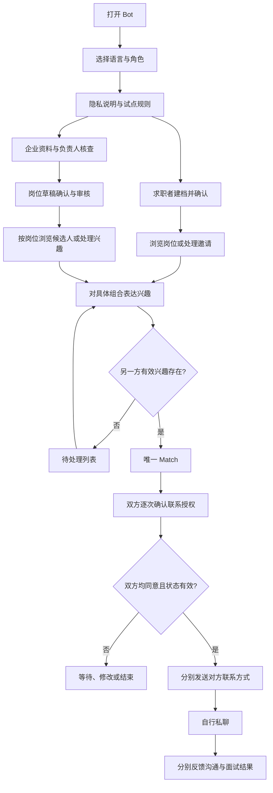

# JobTinder V0.1 Telegram Bot 完整交互流程

版本：0.1｜日期：2026-09-17｜状态：可供实现的交互设计，尚未运行验收

产品范围：**柬埔寨、全岗位类别**。城市按用户实际输入，不默认金边；岗位采用通用字段加专业模板。

关联：[产品定义](JobTinder-V0.1-产品定义.md)。本文所有企业、人物、岗位、薪资和计数示例均为虚构，不代表真实库存。中文是评审文案；高棉语和英语上线文案须人工审校。

命名约定：JobTinder 仅为内部代号，内部概念为 Tinder for Jobs，对外定位为 Swipe-to-Job / Job Matching Network。下文 Bot 文案中的名称是内部评审占位；正式上线前统一替换为独立品牌名。

## 1. 全局导航与状态约定

### 1.1 入口与命令

| 入口 | 用途 |
|---|---|
| `/start` | 新用户进入或老用户恢复 |
| `/menu` | 当前角色首页 |
| `/profile` | 求职卡或企业资料 |
| `/matches` | 当前角色的匹配列表 |
| `/settings` | 语言、角色、可见范围、通知、数据管理 |
| `/help` | 操作说明与人工支持 |
| `/cancel` | 退出当前编辑，保留已经保存的草稿 |
| `/delete` | 进入删除确认，不直接删除 |

深链采用 `https://t.me/<待注册bot用户名>?start=<短token>`。来源 token 只用于归因或已公开岗位定位，绝不赋予企业/管理员权限，不含个人信息。参数的字符和长度遵循 Telegram 的限制。[Deep Linking](https://core.telegram.org/bots/features#deep-linking)

岗位分享链进入后先完成必要告知，再恢复目标岗位；岗位已失效则解释原因并给“查看其他岗位”。来源不存在仍可正常注册，不出现死路。

### 1.2 全局规则

- 全流程在 Bot 私聊内进行；若在群内调用，提示用户打开私聊，不在群里展示求职卡或联系方式。
- 同一用户身份下分别保存求职、招聘草稿。切换角色不覆盖另一角色进度。
- 每轮只追问一个缺失项；每一步有“返回”“保存稍后继续”“帮助”。
- `/start` 不清空资料；中断后提示“继续上次填写 / 返回首页”。
- 自由文字不等于命令执行；无法识别时重述当前问题，保留已有信息。
- 列表分页；每张卡片所有操作绑定该卡实际对象与版本，不能只依赖当前会话变量。
- 用户已经发布的卡片与编辑草稿分开；草稿未确认不改变线上条件。

### 1.3 总流程



## 2. 公共进入流程 G

### G-01：语言与角色

首次进入显示高棉语/英语语言名称，用户可随时切换。Telegram `language_code` 只作为建议，不判断用户语言能力。

选择后展示：

> 欢迎来到 JobTinder。告诉我们你的条件，找到双方都有兴趣的工作机会。

按钮：`找工作` `招聘人才`。两种角色后续均可开启。

### G-02：告知与同意

> 我们会保存你确认的资料，用于岗位匹配。你可选择使用 AI 整理或手动填写。推荐卡不会显示你的联系方式；匹配后，双方另行同意才交换联系方式。
>
> 本轮试点面向年满 18 岁的用户。请先阅读资料使用方式与平台规则。

按钮：`查看隐私说明` `查看规则` `我已满18岁并同意继续` `退出`。

未同意：不建公开卡、不调用 AI，保留最少的必要会话状态；用户可稍后回来。未满 18 岁：解释当前试点不开放，不收集详细年龄或证件。

### G-03：返回用户

- 草稿未完成 → `继续填写` `查看草稿` `首页`。
- 已发布 → 当前角色首页。
- 暂停 → 显示暂停状态，`恢复` `编辑资料`。
- 待核查 → 显示待处理状态与已提交内容。
- 被限制 → 说明受限功能、申诉入口，不泄露举报人。
- 已申请删除 → 显示清理状态；不因 `/start` 自动取消删除。

## 3. 求职者流程 C

### C-01：首页

```text
找工作

[看岗位]       [企业邀请]
[我的兴趣]     [我的匹配]
[我的求职卡]   [设置与帮助]
```

没有发布资料时，`看岗位`引导先创建求职卡；不会假装已经可以个性化推荐。

### C-02：建档方式

> 你可以用一段话介绍想找的工作，也可以逐项填写。
>
> 例如：“我想在暹粒找前台工作，会高棉语和日常英语，有一年经验，可以轮班，下周到岗。”

按钮：`用AI整理文字` `逐项填写` `稍后再说`。

AI 处理前说明必要文本将交给配置的模型服务处理；用户可选择手动路线。提交后立即反馈“正在整理”，默认 15 秒无结果则给手动降级入口；迟到的模型结果不能覆盖用户已经修改的字段。

### C-03：补充字段

按缺失情况逐项询问：

1. 希望从事哪些岗位？类别支持多选及“其他，自己填写”。
2. 哪些城市/区域可以工作？是否愿意换城市？
3. 希望的最低保证工资？依次确认币种、周期、税前/税后；允许“可商议”。
4. 全职或兼职？可接受什么班次？哪项绝不接受？
5. 最早何日到岗？相对日期转为具体日期后确认。
6. 可以用哪些语言工作？每种语言选自评水平。
7. 有哪些相关技能或经验？可选“暂无经验”。
8. 食宿和交通是否有必须满足的条件？
9. 在目标工作地的就业资格情况：`已有` `需要雇主支持` `不清楚`。
10. 根据岗位追加确有必要的字段，例如驾照或专业资质；未知交人工核实。

无相关经验不阻止建档。资格“不清楚”不由 AI 填成合格；资料可保存，但需资格确认的配对不进入自动匹配。

### C-04：预览与发布

```text
求职卡预览 · 仅演示

称呼：求职者 A
意向：前台 / 客服
可工作地点：暹粒
保证工资期望：USD 350/月起，税前
语言：高棉语熟练；英语日常沟通（自评）
相关经验：1 年（自报）
班次：可轮班，不接受通宵班
到岗：2026-09-24
食宿：包餐优先，住宿无要求
就业资格：待人工核实

[修改某项] [保存草稿] [选择可见范围]
```

可见范围：`只向我感兴趣的企业展示` / `向试点已核验企业展示`。再展示 `确认发布`。

发布成功给明确状态：“资料已保存；资格待核实的岗位会先处理确认。”若全部可匹配条件均不完整则显示待补充，不给假推荐。

### C-05：岗位卡与详情

```text
前台接待 · 示例酒店
地点：暹粒，具体工作地址见详情
保证工资：USD 350–450/月，税前
班次：早/中班轮换，不含通宵班
语言：高棉语；日常英语
食宿：包工作餐；无住宿
到岗：两周内
企业资料：人工核查日期与范围见详情

与你的条件相符：地点、工资、班次
需讨论：暂无酒店系统经验

[感兴趣] [跳过]
[岗位详情] [举报/屏蔽企业]
```

示例仅适用于双方关键条件已经确认的情形。卡片不显示虚构“96%匹配”，也不从资料完整度推断胜任能力。

详情包含职责、工作日/休息、浮动工资、实际地点、专业要求、核验范围、发布时间、有效期及原文。暂不公开招聘联系人的私有联系方式。

### C-06：表达兴趣

第一次提示：

> 感兴趣后，这家企业可以看到你的求职卡。双方有兴趣后才会进入匹配；联系方式仍需要另行同意。

按钮：`确认感兴趣` `返回`。之后同类操作可直接记录兴趣，仍显示上述含义的简短提示。

无对方兴趣：显示“已提交，可在‘我的兴趣’查看或撤回”，并给 `继续看岗位`。

已有企业有效兴趣：直接进入 M-01。重复点击返回已有状态，不再次创建或推送。

### C-07：跳过、恢复与空列表

- 跳过仅处理当前候选人—岗位组合；可在“我的兴趣 → 已跳过”恢复。
- 跳过已有企业邀请，更新为 declined；企业只见“未继续”，不收集强制拒绝理由。
- 空列表：“当前条件下还没有合适岗位。”按钮 `修改偏好` `有合适岗位时提醒我` `首页`。
- 不能自动放宽薪资、城市、夜班或资格等硬条件。选择提醒后只在新增合格岗位时发送摘要。

### C-08：企业邀请与我的兴趣

企业邀请必须呈现完整岗位卡，再由求职者 `感兴趣` 或 `暂不考虑`，不能只有一个陌生企业名称。

“我的兴趣”分为待回复、已匹配、未继续、已失效；待回复项支持撤回。过期解释为“未在有效期内继续”，不假称企业已阅读或明确拒绝。

## 4. 招聘方流程 E

### E-01：首页和企业核查

```text
招聘人才

[发布岗位]     [我的岗位]
[候选人兴趣]   [我的匹配]
[企业资料]     [设置与帮助]
```

首次创建：企业名称 → 所在城市 → 行业 → 可核查营业信息 → 联系人 → 代表企业招聘的依据 → 预览提交。

企业审核前可以保存岗位草稿；不能浏览非授权候选人、发邀请或发布岗位。提交即提示待人工处理，不显示“认证成功”。

审核结果：`通过` / `需要补充信息` / `不予开放`。后两者说明可处理原因并给补充/申诉入口。审核人必须记录范围、依据、时间和操作者。

### E-02：一句话生成岗位草稿

> 请描述招聘岗位、实际工作地点、工资、班次、语言和到岗要求。

按钮：`用AI整理文字` `逐项发布` `返回`。

不同岗位使用对应字段模板。所有岗位都要补齐招聘人数、职责、保证工资及口径、班次/工作日、语言、食宿交通、资格支持、到岗窗口、截止时间和联系人。

不把“急招若干人、高薪、包吃住”直接发布。未知工资、地址、雇佣主体或隐含费用必须补充；提成与保证工资分开。

### E-03：预览、审核与上线

预览显示候选人将看到的卡片和完整详情。按钮：`修改` `保存草稿` `确认并送审`。

人工核查后进入 active，通知招聘方有效期和回复要求。拒绝时给出具体修改项，不能让 AI 自动改变审核结果。

“受监管岗位的核验规则尚未就绪”显示待核实，可保存需求但不公开匹配。

### E-04：选定岗位后看候选人

`我的岗位 → 某岗位 → 看候选人`。界面始终显示“当前岗位：xxx”，角色不能在后台悄然切换。

```text
为“前台接待”寻找候选人 · 演示

求职者 A
意向地点：暹粒
期望保证工资：USD 350/月起，税前
语言：高棉语熟练；英语日常（自评）
经验：相关工作 1 年（自报）
班次：可轮班，不接受通宵班
到岗：2026-09-24

条件相符：地点、工资、班次
需讨论：酒店系统经验

[对该岗位发邀请] [跳过]
[查看求职卡] [举报/屏蔽]
```

不显示候选人的 username、电话、头像或性别。明确注明自报字段和核验范围。候选人选择“只向感兴趣企业展示”时，仅该候选人主动表达兴趣的岗位可呈现其资料。

### E-05：处理候选人兴趣

`候选人兴趣 → 选择岗位 → 逐张处理`。

按钮：`对此候选人感兴趣` `暂不继续` `稍后处理`。

同意前重检岗位版本和候选状态；合法则进入 M-01。不得把某岗位的同意复制到其他岗位。

“稍后处理”不算已回复；默认 48 小时后仅提醒一次，7 天后或岗位先失效时关闭待处理项。

### E-06：岗位管理

- **编辑**：关键条件更改创建新版本并重新审核；旧待处理兴趣失效、待联系 Match 需双方重新确认。详情见产品定义第 6.3 节。
- **暂停招聘**：立即停止新曝光、兴趣和联系交换；历史面试记录仍可看。
- **恢复**：有效期内且条件未改可校验后恢复；原未匹配兴趣需重新表达；已有待联系 Match 进入重新确认。
- **招满/关闭**：确认后关闭岗位，停用旧卡动作；已联系对象保留结果反馈。
- **续期**：确认人数与条件，提交核查。过期岗位不能只靠旧消息按钮恢复。

## 5. 匹配、联系方式与结果 M

### M-01：创建 Match

事务内同时满足：双方当前兴趣有效、资料/岗位版本一致、企业与岗位已审核、双方可见、无拉黑、没有暂停/关闭/删除。

```text
双方都有兴趣！

岗位：前台接待 · 示例酒店
双方：求职者 A / 企业招聘负责人

接下来双方可以同意交换联系方式。
匹配不表示已经录用。

[设置并同意分享联系方式]
[查看岗位] [暂不联系] [结束/举报]
```

双方通知分别入队；一方投递失败不撤销已产生的 Match，另一方只看到“等待对方”，不得编造对方已收到。

### M-02：选择本次分享方式

存在 username：显示当前可获取的值，`本次同意分享此Telegram账号` / `更换方式`。

无 username：`设置Telegram用户名后重试` / `使用我提供的邮箱或电话` / `暂不分享`。

邮箱/电话可输入后预览并明确同意；标记为用户提供、未核验。招聘方建议使用业务联系方式。

文案：

> 同意后，当对方也同意时，我们会把此联系方式发给本次匹配的对方。已经发送的信息无法保证从对方设备撤回。

授权前不能把联系方式放进回调 payload、事件日志或推荐卡。

### M-03：等待与撤销

仅一方授权：显示“等待对方同意”，按钮 `更改联系方式` `撤销本次授权` `结束匹配`。

任一方未授权，均不能提前查看对方联系方式。默认 Match 创建后第 3 天提醒一次，第 7 天仍未完成联系授权则归档为 contact_expired。双方主动回来且条件仍有效时可以重新确认，不自动发送。

### M-04：交换联系方式

双方同意后，发送前再次校验授权版本与平台状态，分别发送对方联系方式。

```text
你们已同意交换联系方式。

岗位：前台接待 · 示例酒店
对方：招聘负责人

[打开Telegram聊天]
[联系方式有问题] [举报/结束匹配]

建议首条消息说明具体岗位和可以沟通的时间。
```

有 username 时提供账号链接；没有可靠 Telegram 路径则显示授权的备用渠道。不承诺任何用户 ID 都能强制打开私聊，也不自动创建群。

状态按每位接收者记录 dispatched/failed/unknown。一个发送成功、另一个失败时保留“部分完成”，给失败方重试/更新方式入口；直到两边均成功才记录 contact_dispatched 完成事件。已披露给一方的信息不能假定可回滚。

点击“获取联系方式”可记录请求；普通 URL 按钮打开私聊不等于 Bot 知道已开聊。服务不读取双方私聊，也不自动代表任何一方发送第一条私人消息。

### M-05：联系失败

按钮 `账号打不开` `对方未回复` `联系方式错误` `对方要求不合理费用`。

- 账号/联系方式问题：允许本人更新联系方式并重新授权；对方旧联系方式标记失效，提供人工协助。
- 未回复：可再等、结束或举报；系统不能强制对方回复。
- 风险举报：进入 R-01，相关风险按人工审核规则处理。

### M-06：沟通和面试反馈

联系方式交换后 24 小时提醒一次；7 天后若仍无反馈可再提醒一次，之后停止本次催问。通知关闭、删除、拉黑、结束匹配时取消任务。

求职者与企业分别看到：

> 关于“前台接待”这次匹配，目前进展如何？

按钮：`尚未联系` `已联系未约面试` `已约面试` `未继续` `举报`。

“已约面试”继续填写日期、时间和方式；邀请另一方独立确认同一安排。默认显示柬埔寨当地时间并标注 UTC+7，支持更正。

一方报告：`单方反馈`；双方确认同一安排：`双方确认面试`；时间不同或一方否认：`待核实`，不进入北极星完成数。

面试日期后可由用户主动更新 `已参加` `未参加` `录用` `已到岗`。运营可以代录但必须标记代理人、证据来源和单/双方确认状态，不得直接替双方勾选。

## 6. 资料、通知、举报与删除

### P-01：求职卡管理

`我的求职卡 → 编辑 / 可见范围 / 屏蔽企业 / 暂停求职 / 找到工作 / 删除`。

暂停说明：“停止新推荐和新联系交换；已有联系方式可能仍在对方处。”选择找到工作后暂停推荐，不自动将所有 Match 算录用。

恢复时确认城市、岗位、工资、班次和到岗日期；若已变化，按新版本重新匹配。

### N-01：通知设置

默认开通必要业务通知；推荐摘要需用户选择。可分别关闭推荐、兴趣提醒和结果回访，另有全部非必要通知开关。

默认试点规则：新兴趣合并摘要，每人每天最多一次；Match/联系授权即时业务通知；全局每日主动通知最多 5 条并合并同类事项，举报处理和安全处置另列。队列必须检查当前偏好，不能只在任务创建时检查。

默认静默时段 21:00–08:00（Asia/Phnom_Penh），常规主动消息延后；用户主动操作的即时答复正常返回。首页持续显示未处理项，避免推送没到就无法处理。

Telegram 普通 Bot 不能主动联系从未与它交互过的用户；应让双方自行打开 Bot 后参与。[Telegram Bot 介绍](https://core.telegram.org/bots#how-are-bots-different-from-users)

### R-01：举报和屏蔽

所有岗位卡、候选卡和 Match 均有入口。

分类：虚假身份/企业、条件不实、收费或诈骗、骚扰、危险安排、其他。允许简述和自愿提供证据，提示遮盖无关隐私。

提交后返回工单号和已采取动作。求职者可选择 `同时屏蔽整个企业`；企业可 `屏蔽候选人`。屏蔽立即生效，不等待举报判定。

高风险举报先限制相关岗位曝光和新增联系，再人工核查。管理员可补充证据、恢复、限制、封禁；均记录原因。被处理方可申诉，看不到举报者身份。

明确告知：JobTinder 内屏蔽不会自动修改个人 Telegram 的屏蔽列表；需要阻止站外消息时用户应在 Telegram 中另行操作。

### D-01：删除

```text
你要删除哪些资料？

[删除求职资料]
[关闭企业招聘资料]
[删除整个账号]
[取消]
```

账号有双角色时，删除求职资料不误删企业记录。企业唯一负责人删除账号前，选择关闭全部岗位；V0.1 暂无自助转交功能，确需转交交运营核验。

最终确认展示影响：资料停止展示、未完成授权取消、待处理兴趣失效、队列取消、数据清理期限，以及已分享信息不能保证撤回。按钮 `确认删除` / `取消`。

确认后立即撤下并记录删除任务；清理成功后才标记已完成。删除期间 `/start` 仅显示状态，不自动恢复资料；重新加入须在清理完成后重新同意建档。

## 7. 状态机与异常路径

### 7.1 持久化业务状态

| 对象 | 主要状态 | 转移规则 |
|---|---|---|
| 求职卡 | draft → active ↔ paused → deleting → deleted；另有 restricted | active 还需通过每次配对的条件检查；资格未知不等于全部合格 |
| 企业 | draft → pending_review → verified / needs_info / rejected；另有 suspended | 只有 verified 可发布经过审核的岗位 |
| 岗位 | draft → pending_review → active ↔ paused → closed / expired；另有 rejected / suspended | 关键编辑创建待审新版本，旧版本停止新撮合 |
| 单侧兴趣 | pending → matched / declined / withdrawn / expired / invalidated | 仅同版本的有效双向 pending 可转 matched |
| Match | awaiting_contact → contact_ready → contact_shared → archived | contact_ready 为双授权完成；按双方投递状态判断 contact_shared |
| Match 特殊状态 | needs_reconfirmation / contact_expired / ended / blocked | 版本变化、超时、主动结束、屏蔽分别处理 |
| 结果反馈 | unknown / contacted / interview_scheduled / interviewed / offered / started / not_continued | 每个报告方独立记录；不是强制线性晋级 |

暂停、关闭、删号、拉黑均覆盖普通状态流。恢复不自动恢复旧授权；需要重新确认的状态回到相应确认流程。

### 7.2 异常响应表

| 触发 | 用户反馈 | 服务处理 |
|---|---|---|
| AI 超时/失败 | “暂时无法整理，可以继续逐项填写” | 保存草稿，迟到结果不得覆盖已确认字段 |
| 薪资口径不完整 | “请先确认币种/计薪周期” | 不进行薪资硬过滤判断 |
| 专业资格未知 | “此项需要补充或人工核实” | 不给合格标签，不进入该岗位自动 Match |
| 重复按钮或重复更新 | 显示当前已完成状态 | 幂等返回，不再次新增兴趣/Match |
| 两方同时表达兴趣 | 双方均看到同一 Match | 事务锁/唯一约束处理竞争 |
| 旧卡在岗位改价后被点击 | “条件已更新，请查看后重新确认” | 拒绝旧版本动作 |
| 招聘方尝试访问他企对象 | “此内容不可访问” | 服务端拒绝并记录，不透露对象详情 |
| 用户切换角色后点旧卡 | “请切回相应身份处理” | 重新校验实际身份和权限，不能借角色名授权 |
| 无 username 或链接打不开 | “选择备用联系方法或稍后设置” | 不构造保证可用的私聊链接 |
| 用户撤销授权后队列尚未发出 | “已撤销本次授权” | 发送前复查并取消；已发送部分说明无法保证撤回 |
| Bot 被用户屏蔽 | 无法实时反馈 | 停止通知重试；若处于发布状态转为需重确认，暂停新兴趣路由 |
| 通知限流/暂时失败 | 首页仍可查看处理项 | 遵循返回的重试时间并设置上限，保留失败记录 |
| 请求超时且不知是否送达 | “发送状态待确认” | 标记 unknown，不立即盲目重发联系方式 |
| 没有匹配库存 | “当前暂无符合条件的对象” | 给显式改条件和订阅入口，不塞不合格对象 |
| 数据库/服务重启 | 返回后继续最近已保存步骤 | 会话、业务事件、通知队列均可恢复 |
| 结果双方不一致 | “结果待核实” | 保留两份反馈，不自动合成面试或入职成功 |

### 7.3 Telegram 技术边界

实现前应以当时官方文档复查。当前设计依赖以下基础能力：[Bot API](https://core.telegram.org/bots/api)

- `update_id` 用于更新去重；`callback_query.from.id` 标识实际操作者。
- `callback_data` 限 1–64 bytes，使用短 token 引用服务端对象；`answerCallbackQuery` 及时结束按钮等待。
- 使用 webhook 时核验配置的 secret header；不要把 token 写进日志或公开文档。
- 普通 URL 按钮与 callback 按钮不同：URL 点击不能当作 Bot 已接收的业务事件。

其余事务、授权、配额、状态和队列规则是本产品设计要求，并非 Telegram 自动提供的保证。

## 8. 验收脚本索引

本节是待执行场景，不是测试通过报告。真实 Telegram 手机端、服务日志和数据库记录应互相对应。

| 场景 | 操作与预期 | 对应产品验收 |
|---|---|---|
| T-01 正向匹配 | A 建档并对岗位感兴趣 → 企业针对该岗位同意 → 仅一个 Match | AC-01 |
| T-02 反向匹配 | 企业选择岗位并邀请 → A 同意 → 与正向同一数据规则 | AC-01 |
| T-03 并发重复 | 双方同时点击且模拟重发更新 → 一个兴趣/单侧、一个 Match | AC-02 |
| T-04 联系授权 | 仅 A 同意时均无对方联系方式 → 双方同意且有效后分别发送 | AC-05 |
| T-05 无用户名 | A 无 username → 选择授权备用方式或暂不联系 → 不出现死链承诺 | AC-05 |
| T-06 更新条件 | 初次兴趣后企业改工资 → 旧按钮无效、须双方确认新版 | AC-06 |
| T-07 生命周期 | 分别在兴趣、Match、待发送三个阶段暂停/关岗/拉黑/删除 → 队列和操作停止 | AC-03 |
| T-08 权限 | 企业 B 尝试企业 A 的按钮 token → 访问拒绝，无候选信息外泄 | AC-03 |
| T-09 AI 降级 | 整理超时后手动完成 → 迟到 AI 不覆盖；关键缺失字段需确认 | AC-04 |
| T-10 投递失败 | 一方屏蔽 Bot 或接口超时 → 不重复 Match，不假称已联系 | AC-07 |
| T-11 结果口径 | 单方报面试 → 不算双方确认；双方时间一致确认 → 计一次 | AC-10 |
| T-12 恢复与语言 | 中断、重启、角色/语言切换 → 恢复正确草稿；高棉语手机文案可读 | AC-08/09 |
| T-13 数据删除 | 删除后旧按钮、待发送、搜索均不可见；清理任务和备份周期验证 | AC-09 |
| T-14 全岗位模板 | 服务、驾驶、技术及“其他”分别建档/发岗 → 共用匹配流程、专业字段不丢失 | AC-04/08 |

开发完成的判断顺序：实现 → 有意义的自动化验证 → 真实数据库 → 两个 Telegram 测试账号 → 高棉语人工审校 → 小批真实供需试点。仅文档、单元测试或 Bot 能响应 `/start` 均不代表业务闭环完成。
