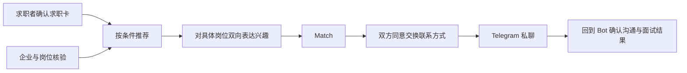

# JobTinder V0.1 产品定义

版本：0.1｜日期：2026-09-17｜状态：产品设计草案，未开发、未试点

相关文档：[Telegram Bot 完整交互流程](JobTinder-V0.1-Telegram-Bot交互流程.md)

## 1. 定义与已确认边界

**JobTinder：像刷 Tinder 一样找工作，双方感兴趣才开始聊。**

内部概念：**Tinder for Jobs**。匹配对象仍为人与具体岗位。

产品定位：面向柬埔寨、覆盖全岗位类别的 Telegram 原生、AI 辅助招聘匹配服务。

用户语言：**说清你想找的工作，看到适合的岗位，双方有兴趣再联系。**

对外定位：**Swipe-to-Job / Job Matching Network**。

命名约定：根据用户于 2026-09-17 的更名要求，内部项目代号由 JobMatch 改为 **JobTinder**。正式上线前另定独立品牌；代号与类比不作为品牌可用性或与 Tinder 存在关联的声明。本文引用的竞品保留其真实名称。

“Recruitment Matching Network”是产品模型；“AI Talent Matching Infrastructure for Southeast Asia”保留为远期方向，不作为 V0.1 已具备的能力。已有 Telegram 的用户无需再安装独立招聘 App。

| 项目 | 状态 |
|---|---|
| 内部项目代号 JobTinder | 用户已确认；原代号 JobMatch 停止用于本项目命名 |
| 首发国家柬埔寨 | 用户已确认 |
| 岗位范围 | 用户已确认“全部”，不限定行业；不代表已拥有所有行业供给 |
| 城市分布、企业名单 | 待确定；不默认金边或任何城市 |
| 正式品牌、商标、域名、Bot 用户名 | 未确定、未核验可用性 |
| Telegram Bot + 卡片按钮 | 本稿建议的 V0.1 形态 |
| 高棉语和英语用户界面 | 本稿建议；上线前须本地人工审校 |
| 中文招聘方界面 | 按首批企业需求确定；本稿中文文案是设计稿 |
| 收费和企业付费意愿 | 尚未验证；V0.1 不接支付 |
| 软件、用户、收入、招聘成果 | 本次未实现或验证 |

## 2. 先检验方向，再定义范围

### 2.1 最强反对理由

**Known Facts｜已知事实**

- 用户确认柬埔寨、全部岗位；没有提供城市分布、招聘方数量、预算或渠道数据。
- App Store 的 JobMatch - Swipe Jobs 自述支持双方浏览选择及匹配后聊天；页面同时显示评论量不足以生成汇总。这证明同类交互已经存在，不能证明招聘转化、盈利或产品市场契合。[App Store](https://apps.apple.com/us/app/jobmatch-swipe-jobs/id6763127291)
- 泰国、越南以及其他市场存在使用原候选名 JobMatch 的产品，具体核实记录见第 13 节；它们不是本项目的产品。

**Assumptions｜假设**

- 首批目标企业与求职者愿意在 Telegram 完成招聘流程。
- 某个城市、某类岗位有足够密集且同时活跃的供需。
- 企业愿意提供明确条件并及时处理候选人；用户愿意确认 AI 整理的信息。

**Inferences｜推断**

- 早期最可能的瓶颈是供需密度、真实岗位和企业回复速度，滑动体验只能降低部分操作成本。
- AI 整理资料可能降低建档成本，但需要用人工改错成本抵扣节省量。
- 全岗位覆盖会提高分类和供需组织难度，必须按城市与岗位类别观察，不能用总量证明每个局部市场有效。

**Unknowns｜未知**

- 哪个城市、哪类岗位最容易拿到第一批真实供需；目标人群对 Telegram 的实际使用率。
- 既有招聘渠道的响应速度、面试转化和单位获客成本。
- 企业可接受的价格、审核工时、本地语言支持成本与正式运营的适用要求。

**三个最强失败原因**

1. **供需没有交集。** 看似有注册量，但地点、语言、工资、班次不匹配，双方看不到可成交的对象。
2. **企业不回复或岗位不真实。** 双向喜欢无法转化为联系与面试，候选人很快失去信任。
3. **渠道和 AI 被高估。** 目标用户不愿使用 Telegram，或 AI 误填关键条件导致人工成本高于原有流程。

### 2.2 经反对理由检验后仍成立的支持理由

**三个最强成功理由**

1. 如果首批双方已经使用 Telegram，Bot 可复用现成入口和通知，适合低成本小规模验证。
2. 如果本地运营方能持续提供核验岗位，明确的工资、班次、食宿与到岗信息可能减少无效沟通。
3. 如果 AI 只做资料草稿，并由双方确认，能用较小风险验证是否真的节省建档时间。

这些支持理由都有条件，不能直接推出全柬埔寨乃至东南亚扩张。真正可能累积的优势是可持续供给、信任记录、回复习惯与面试反馈，而不是 Like 按钮本身。

### Verdict

按用户确认的**柬埔寨全岗位**范围定义产品，先开展小规模人工辅助试点，并按城市和岗位类别分组验证。暂不按泛东南亚平台投入完整建设。当前证据更支持有限验证，尚不足以证明所有岗位类别都能形成有效供需。

### Confidence

**75%**。这是对“先用小样本分组验证”这一建议的判断信心，不是创业成功概率；市场证据仍偏弱。

### Why

交互可行、同类产品存在，但本项目尚无供需、回复、面试或付费数据。可以先用可逆试点检验最关键假设。

### Key Variables

1. 每个城市、岗位类别内的可匹配供需密度。
2. 核验企业的岗位质量与 48 小时回复率。
3. 每次双方确认面试所消耗的获客与运营成本。

### Largest Unknown

能否持续拿到愿意及时回复、条件真实且有实际招聘需求的企业。最重要的缺失证据是首批企业的真实空缺、招聘联系人和实际回复记录。

### Reversal Condition

若不能形成最小供需样本，或目标双方普遍不愿使用 Telegram，应改入口或暂停该方向；若连续两个试点批次都稳定形成面试且企业实际愿意付费，再提高自动化与投入。

## 3. 产品闭环与角色

核心机制：

```text
Candidate ❤️ Job
+
Employer ❤️ Candidate（针对同一岗位）
= Match
→ Chat
→ Interview
→ Hire
```

产品围绕“匹配”组织体验。上述为目标推进路径，不保证每次 Match 都会面试或录用；Chat 前须完成双方联系授权，后续结果分别反馈和确认。



- **求职者**：建立求职卡、设置条件、浏览岗位、处理邀请、联系与反馈。
- **招聘方**：代表企业建立岗位、处理候选人、发起岗位邀请、维护招聘状态。
- **运营人员**：核验企业与岗位、处理举报、跟进联系障碍、回收结果。

一个 Telegram 账号可同时拥有求职者和招聘者角色；切换角色不生成第二份用户身份。V0.1 每家企业一个负责人，不开放跨企业共享候选人或企业多人协作。

**匹配键：candidate_id + job_id。** 企业喜欢某人，必须明确代表哪个岗位。不能把“公司对某人感兴趣”自动扩展为该公司所有岗位的兴趣。

## 4. V0.1 范围

| 编号 | P0 必须具备 | 可验收结果 |
|---|---|---|
| P0-01 | 入口、语言、角色、隐私告知 | 首次进入和再次进入均能找到正确进度 |
| P0-02 | 文字建档、AI 草稿、逐项编辑、手动降级 | AI 不可用仍可完整建档 |
| P0-03 | 企业核验、岗位审核与有效期 | 未核验企业和未审核岗位不能进入推荐 |
| P0-04 | 条件筛选与可解释推荐 | 每张卡显示匹配理由和待确认事项 |
| P0-05 | 感兴趣、跳过、邀请与待处理列表 | 正向与反向发起均能到达同一匹配记录 |
| P0-06 | 双向兴趣和联系方式授权 | 无双向有效兴趣不 Match，无双方授权不交换联系方式 |
| P0-07 | 结果跟进 | 区分请求联系方式、单方自报和双方确认面试 |
| P0-08 | 编辑、暂停、恢复、关闭、删除 | 旧卡和旧按钮不能绕过最新状态 |
| P0-09 | 举报、拉黑、运营审核 | 拉黑即时停止平台内新推荐、联系释放和提醒 |
| P0-10 | 最小后台与事件记录 | 能追溯审核、匹配、授权、通知失败和反馈 |

**P1**：语音转写、简历导入、更多岗位模板、收藏、企业多人协作、精细通知、面试预约。

**P2**：Mini App 真正滑动界面、收费、付费曝光、外部 ATS、跨国招聘、多渠道接入、学习排序。

V0.1 的“刷”是逐张卡片按钮操作。原生 Bot 消息不做成虚假的手势滑动 App。照片、性别、婚姻、外貌评分不是建档必需项或排序依据；不复制 Dating 的外貌中心设计。

## 5. 信息模型与 AI 职责

### 5.0 全岗位分类与模板

用户可选择服务/零售、生产/仓储/物流、行政/财务/客服、销售/市场、技术/工程/建筑、教育/专业服务，以及“其他岗位”并输入名称。分类是导航，不是行业准入白名单；一个用户可以选择多个意向类别，单个招聘岗位归属一个主类别并附技能标签。

所有类别共用地点、薪资、工作时间、语言、到岗和联系方式规则，再按具体工作追加字段：驾驶类追加所需驾照与车辆类型；技术类追加技能和项目经验；生产类追加操作技能与班次；专业岗位追加必要资质及核验状态。类别模板未覆盖时由人工补充必需字段，不用 AI 猜测资格要求。

“全岗位”不意味着无审核发布。受监管或存在特殊风险的岗位，在相应核验能力就绪前可以保存草稿和登记需求，但不能以“已核验”公开撮合；适用标准需要按实际岗位核查。目录覆盖、开放发布、真实库存是三个独立状态。

### 5.1 求职卡

| 字段 | 发布要求与处理 |
|---|---|
| 展示称呼、岗位类别 | 必填；不强制真实全名 |
| 可工作城市/区域、是否愿意换城市 | 必填；不收集住宅精确坐标 |
| 期望工资、币种、周期、税前/税后口径 | 填明确值或“可商议”；未知不自动转换 |
| 可接受班次、全职/兼职、最早到岗日 | 必填；日期需用户确认 |
| 语言及自评水平 | 必填；不从姓名、国籍或 Telegram 界面语言推断 |
| 技能、相关经验 | 可填写“无经验”；必需证书仅在岗位确有要求时询问 |
| 食宿、交通需求 | 各自区分“必须”“希望”“无要求” |
| 在工作地的就业资格情况 | 用户自报“已有/需支持/不清楚”；不是平台核验结论 |
| 18 岁及以上确认 | 本稿建议的试点准入规则；不是当地最低就业年龄判断 |
| 联系方式 | 与推荐卡分开；首次 Match 后再请求授权 |
| 可见范围、状态 | 仅本试点已核验企业，且须主动发布 |

用户可选择“仅向我感兴趣的企业展示”或“向试点已核验企业展示”。前者不进入企业主动搜索池，只向对应岗位的企业展示资料。现有雇主可按平台企业 ID 屏蔽；明确告知无法保证覆盖别名、关联公司或站外转发。

### 5.2 企业与岗位

- 企业：名称、运营城市、行业、可独立核查的营业信息、招聘负责人及代表该企业招聘的依据。徽标写“资料经人工核查”，同时展示核查范围与日期，不能写“政府认证”。
- 岗位：名称、类别、实际地点、人数、雇佣类型、工作职责、保证工资范围、币种、计薪周期、税前/税后口径、提成/加班说明、班次、工作日与休息安排、语言、必需技能、到岗窗口、食宿/交通、资格支持情况、截止日期。
- 试点支持 USD/KHR 作为可选工资币种，不把这项产品设置描述为当地工资支付规则；不暗中按实时汇率或月工时折算。
- 工资中区分保证部分与浮动部分。只写“最高可达”或条件缺失的岗位退回补充。
- 首次发布、关键条件更改和失效后重新开放，都进入审核。关键条件包括地点、工资、班次、职位职责、资格要求和招聘主体。
- 招聘联系人只能由该企业授权负责人维护；转交联系人后须重新确认联系授权。

### 5.3 AI 的严格边界

AI 的产物是**草稿**：抽取字段、标准化岗位名称、追问缺失信息、生成便于阅读的卡片。推荐理由优先由确认字段和规则生成。

处理顺序：文字输入 → 字段草稿 → 缺失项逐个追问 → 全卡预览 → 用户确认 → 发布/送审。

1. 未提供的信息保留 unknown，不能虚构经验、证书、工资、语言能力或就业资格。
2. 每个字段保存来源、原始语言、确认状态和版本；用户改动优先于模型草稿。
3. AI 不代替用户点赞、发布、交换联系方式或接受面试，不给出录用资格结论。
4. AI 异常时展示手动表单式对话；不丢失已确认字段。文字是 P0，语音属于 P1。
5. 上传内容和职位描述均视为数据，不能让其中的指令修改系统权限、审核结果或规则。
6. 不把联系方式、证件或完整 Telegram 原始更新发送给模型；发送建档必要字段前说明处理方式并提供手动选项。
7. 跨语言保留原文入口，关键工资、地点、班次和资格条款须确认译文；未经本地审校不宣传已支持流利高棉语。

## 6. 推荐、兴趣与匹配规则

### 6.1 硬条件先行

候选人与岗位均可见且有效；企业已核验；无双方/企业级拉黑；符合候选人的资料可见范围；不自匹配。

在此前提下检查城市、工作类型、不可协商班次、保证工资、必需语言/技能、到岗窗口及用户自己设置的必须条件。

- 明确冲突：不进入普通推荐。
- 关键硬条件未知：进入“待补充”而非当作合格；先补充再开放表达兴趣。
- 就业资格需人工确认：允许单独的“待核实资格”队列供运营核实，但不进入自动匹配闭环。
- 软偏好不一致：可推荐，卡片明确提示；只有用户主动修改偏好才放宽条件。
- 工资只比较同币种、同周期、同口径的数据；不同口径需补充确认，不能据此生成虚假匹配率。

V0.1 排序顺序为：已收到的岗位兴趣/邀请 → 确认字段的相关程度 → 最近在本 Bot 内确认可用的时间 → 轮换曝光。未知不加分。排序由规则完成，模型不做最终招聘筛选。

### 6.2 兴趣行为

求职者动作针对岗位；企业动作针对该岗位下的候选人。一方可先表达兴趣，另一方收到待处理项。

- 跳过：仅隐藏该候选人—岗位组合，不通知对方；可从历史恢复。
- 一方正向兴趣：pending，默认 7 天有效或随岗位更早失效，可撤回。
- 接收方跳过已有邀请：该邀请 declined，从未读计数移除，不发送带拒绝理由的通知。
- 同一版本组合被拒绝后不反复推送；仅接收方主动恢复才重新开放邀请。
- 对方响应时重新检查全部状态与版本；有效双向兴趣才创建 Match。
- 同一组合只保留一个 Match 主记录；后续变更记录为事件或重新确认轮次。

### 6.3 变更与过期

岗位默认审核后 14 天过期，可设置更早日期；续期必须确认条件与招聘人数。具体天数是可调整的试点默认值。

关键岗位条件更改：旧版兴趣失效，待交换联系的 Match 转为 needs_reconfirmation；企业确认新版候选人条件，候选人重新确认岗位。已交换的联系方式无法收回，只能停止新的平台联系入口并提示变更。

求职者关键条件更改采用同样版本机制；求职者暂停或岗位暂停时不再新匹配/新交换联系，恢复后必须重新校验。岗位关闭则未完成匹配终止；已有 Match 保留结果反馈入口。

## 7. 联系方式与站外沟通

Match 只表示双方对**当前版本的具体岗位**有兴趣，不是录用、雇佣合同或联系方式授权。

双方逐次确认：“同意将此联系方式发给这次匹配的对方。”双方完成前均不能查看另一方联系方式。默认优先 Telegram username；无 username 时可设置后重试，或主动选择业务邮箱/电话并明确同意分享。

Telegram username 是可选字段，不能假定每人都有；部分用户链接也受隐私设置影响。[Telegram Bot API](https://core.telegram.org/bots/api#user)

联系方式应从账号当前可获取数据确认或由用户明确提供；平台对手填电话/邮箱标明“用户提供，未核验”。释放前重新核验授权、角色、拉黑状态和岗位版本。

不依赖普通消息转发来暴露账号；不开发 Bot 代理双方自由聊天。对联系方式不可用的情况提供更新和人工协助入口。

普通 Bot 不在双方私聊中，不能以 Bot 的通知成功、联系方式展示或按钮点击推定他们已经开聊。沟通和面试结果通过各方主动反馈记录。[Telegram Bots FAQ](https://core.telegram.org/bots/faq#what-messages-will-my-bot-get)

## 8. 信任、安全与运营

| 编号 | 产品要求 | 处理与验收 |
|---|---|---|
| SAFE-01 | 企业和岗位人工核查 | 首批企业逐一核对招聘主体、联系人、实际工作地点与条件，记录依据和时间 |
| SAFE-02 | 招聘风险拦截 | 试点拒绝向求职者收取入职保证金、扣押证件、隐瞒地点或要求前往不明地点的岗位；这是平台政策 |
| SAFE-03 | 数据最小化 | 不以人脸、性别、宗教、健康或完整身份证件建推荐标签；不收集求职者住址 |
| SAFE-04 | 举报和拉黑 | 候选人可屏蔽整个企业；企业可屏蔽候选人；平台内双向停止新触达 |
| SAFE-05 | 紧急处置 | 涉及收款诈骗、限制人身自由等严重线索先隐藏相关岗位并交人工核查，提供申诉入口 |
| SAFE-06 | 暂停与删除 | 删除确认后立即撤下资料、撤销未使用授权、停止提醒并进入清理队列 |
| SAFE-07 | 权限 | 企业只能访问自己岗位已获准展示的候选卡与 Match，运营操作留审计 |
| SAFE-08 | 反骚扰 | 每名候选人—岗位去重、每日兴趣配额、通知退订、无无限追问 |
| SAFE-09 | AI 与日志 | 日志不保存密钥、联系方式或完整输入正文；个人资料不直接进入分析事件 |

设计默认：原始 AI 建档文字确认后最多保留 7 天；用户主动删除后，服务内可删除资料在 7 天内完成清理，备份在 30 天内轮换清除。清理失败进入运营告警，不能先宣称已删完。匿名统计可保留，争议记录如须例外保留应单独限制访问并告知原因与期限。上述是待落实的数据保留方案，须在采集真实数据前落实到实际存储与隐私说明。

Telegram 消息、已分享资料或对方截图不在本服务可完全控制的删除范围；在发布和交换前说明。平台内拉黑不等于在用户个人 Telegram 账号中拉黑对方。

运营规则：工作时段和负责人在试点前明确；严重风险自动隐藏后进入优先队列；普通审核/举报以 1 个工作日内处理为目标。目标超时必须暂停新增量，不承诺尚未配置的全天候服务。

国家、岗位确定后，正式采集与运营前须核查适用的招聘服务、数据处理和就业要求；本稿不对当地法律作结论，也不将 18+、人工核查或用户自报当成合规完成。

最小后台包含：企业审核、岗位审核、候选状态、举报、Match 与结果、失败通知、事件指标。没有付款时不开发财务模块。

## 9. 数据与实现约束

这是建议的逻辑模型，不是已创建的数据库。当前目录没有已有业务代码，未据此虚构项目架构。

| 实体 | 关键字段/约束 |
|---|---|
| users | 内部 ID、唯一 telegram_user_id、可选 username、语言、角色、通知偏好、状态 |
| candidate_profiles | user_id、字段及确认来源、version、可见范围、状态 |
| companies / memberships | 企业状态、核查记录、唯一负责人、成员授权关系 |
| jobs | company_id、条件、version、review_status、状态、expires_at |
| impressions | viewer_id、candidate_id、job_id、版本、card_sent_at；不伪称已阅读 |
| interests | candidate_id、job_id、actor_side、版本、状态、到期时间；单侧当前兴趣唯一 |
| matches | candidate_id + job_id 唯一、版本、状态、生成时间 |
| contact_consents | match_id、授权人、联系方式引用、版本、授权/撤销时间 |
| outcomes | match_id、报告方、结果、面试时间、报告时间；双方反馈分存 |
| blocks / reports | 发起者、目标用户/企业/岗位、原因、处理状态 |
| conversation_sessions | user_id + role、状态、草稿版本、最近有效交互 |
| update_receipts / notification_outbox | 更新去重、待发送内容引用、业务去重键、重试状态 |
| audit_events | 操作者、对象、动作、原因、版本、时间；不写敏感正文 |

建议采用单体服务、关系数据库与数据库任务队列即可完成试点。保留 Bot 适配、建档、审核、匹配、通知五个模块边界；技术栈由现有部署条件确定，不预先拆微服务。

**一致性要求：**兴趣写入、配对状态检查、Match 创建和通知入队使用同一事务；对组合加锁或等价并发控制。数据库唯一约束兜底，不能靠“先查询没有，再插入”保证唯一性。

所有回调都重新校验操作者和对象权限。短 token 映射服务器记录，不信任前端传入的企业、角色或审核状态。异步发送前再次检查删除、拉黑、授权撤销和岗位状态。

通知区分 queued、sent、failed 和 delivery_unknown。请求超时不代表对方未收到；Telegram 发送并不提供本产品的业务级精确一次承诺，遇到不确定结果应避免立即盲重试。Match 唯一和消息绝对不重复是不同问题。

## 10. 指标：以面试结果衡量价值

北极星指标：**每周双方确认已安排面试的去重 Match 数**。它表示约定面试，不表示面试已举行或已经入职。

所有指标按同一批次、城市和岗位类别分组；分母为零显示“暂无样本”。测试账号、运营模拟、作废岗位独立标记并排除。

| 指标 | 口径 | 证据边界 |
|---|---|---|
| 建档完成率 | 7 天内确认并发布的求职者 / 开始建档的去重求职者 | 不把草稿算已完成 |
| 可匹配覆盖率 | 发布后 48 小时内至少有 1 个合格岗位的求职者 / 同期发布求职者 | 同时报告 0、1、2、3+ 岗位的分布 |
| 企业 48 小时处理率 | 48 小时内同意或拒绝的候选兴趣 / 已成功通知且观察满 48 小时的兴趣 | 另报通知失败，不能从漏斗隐藏 |
| 7 天 Match 转化率 | 首次单向兴趣后 7 天内 Match 的组合 / 已观察满 7 天的首次单向兴趣组合 | 同一组合两次点赞不重复作分母 |
| 联系方式释放率 | 双方授权且完成联系方式发送的 Match / 有效 Match | 不叫开聊率 |
| 双方确认沟通率 | 双方分别确认已联系的 Match / 观察满 7 天的 Match | 自报信息，不是读取聊天所得 |
| 双方确认面试数 | 双方确认同一场面试安排的去重 Match 数 | 任一方否认或时间不一致均待核实 |
| 面试出席、录用、入职 | 各方分别反馈，再标记是否双方确认 | 不用“约面试”代替“到岗” |
| 单次确认面试成本 | 同批获客支出 + 基础设施/AI 分摊 + 运营工时成本，除以确认面试数 | 无面试时报告成本及零产出，不填 0 成本 |

建议事件：bot_started、profile_started、profile_confirmed、job_approved、card_sent、interest_recorded、match_created、contact_consent_granted、contact_dispatched、outcome_reported、report_created。

每条业务事件记录对象与版本、服务端时间、去重键和批次。通知成功与用户实际阅读分开，普通 URL 按钮也不能默认提供点击回调。点击“获取联系方式”的 callback 可记录请求动作，但后续打开私聊仍不可见。

## 11. 最小验证实验

这些是建议的预先判定阈值，不是行业基准或已经承诺可达到的结果。

| 项目 | 设计 |
|---|---|
| Hypothesis | 柬埔寨真实供需愿意通过 Telegram，以明确条件和双向兴趣推进面试；不同城市与岗位类别可能有不同结果 |
| Test | 不限定行业，招募 5 家经核查企业、10 个真实开放岗位、40 名主动加入且确认资料的求职者；按实际城市与岗位类别分组，运营协助建档与配对 |
| Success Metric | 满足样本门槛；至少 60% 求职者在 48 小时内有 1 个合格岗位；企业兴趣处理率至少 70%；14 天内至少形成 6 个双方确认面试安排，覆盖至少 3 家企业 |
| Failure Threshold | 到第 7 天仍无法达到样本门槛，则判供需获取不足；达到样本后，覆盖率低于 30%、企业处理率低于 40% 或面试数少于 3，则暂停扩量并定位原因 |
| Time Limit | 14 天；第 1–7 天纳入主要样本，第 8–14 天完成相应观察；未满观察窗的事件单列，不能算失败或成功 |
| 成本边界 | 优先人工辅助，不买量、不做完整平台；建议运营投入上限 20 小时，所有人工协助记录耗时；新增付费支出另定上限 |
| Decision After Test | 全部达标后开展第二批次和自动化；介于失败线与成功线之间，仅调整一个主要因素复测；触发失败线或严重风险则停止扩量 |

每天记录：各城市和岗位类别的合格供需数、硬条件不符原因、企业处理时长、未联系原因、确认面试数、审核与协助时间。某分组不足 10 名候选人或 3 个岗位时只报告原始计数，不下该类别市场有效的结论。总样本通过也只验证已观察的部分，不能外推为全岗位验证完成。招募要经用户主动参与，不抓群成员或自动私信陌生人。

AI 子实验：从上述样本中抽取 10 人尝试草稿建档，记录总完成时间、用户修改字段数量及关键字段错误。无论时间是否节省，工资/地点/资格等未确认错误都不能直接发布。AI 是否纳入下一阶段取决于含人工修正后的净节省，不因主实验成功就自动判 AI 有价值。

本试点不证明优于传统招聘渠道。若要声称效率提升，第二批次需要同类岗位、同一时段的现有渠道对照；付费意愿也须另测，不能以口头称赞替代实际付款。

## 12. V0.1 验收与启动顺序

| 编号 | 必须完成的验证 |
|---|---|
| AC-01 | 求职者先表达兴趣、企业后同意，和企业先邀请、求职者后同意，两条路径都只生成一个 Match |
| AC-02 | 同时点击、重复更新、旧按钮、服务重启均不重复生成 Match 或越权释放联系方式 |
| AC-03 | 企业未核验、岗位过期/暂停、用户删除/拉黑、跨企业访问被正确拦截 |
| AC-04 | AI 错填、超时、关键条件缺失、币种或周期不同，能回到确认/补充流程 |
| AC-05 | 无 username、拒绝联系授权、撤回授权、联系方式失效都能安全结束或恢复 |
| AC-06 | 岗位关键条件变更，旧兴趣与待联系 Match 必须重新确认 |
| AC-07 | 通知失败、超时状态不明、重试、取消通知均可追踪；主业务记录不会丢失 |
| AC-08 | 真实 Telegram 两个测试账号和真实数据库完成完整流程，手机端检查文案及按钮 |
| AC-09 | 高棉语关键字段经过人工审校；删除任务、权限隔离和日志脱敏实际验证 |
| AC-10 | 面试/沟通指标能由双方反馈重算；不将测试、点击或单方自报混作完成结果 |

以上都是待执行验收，未执行项不能标记通过。

启动顺序：整理全岗位分类与首批城市供需分布 → 确认首批企业来源和运营负责人 → 人工试点与本地要求核查 → 根据结果确定软件实现与部署 → 真实端到端验收 → 小范围开放。

当前国家与全岗位范围已确认；仍需明确首批真实企业、所在城市、可触达求职者数量、语言和预算。不能把国家与范围答案扩展成已有当地业务资源。

## 13. 核实记录与来源边界

核实日期：2026-09-17。以下是读取公开页面所得，不代表已体验产品、审计经营数据或完成名称权利检索。

| 来源 | 本次可确认 | 不能据此确认 |
|---|---|---|
| [JobMatch - Swipe Jobs](https://apps.apple.com/us/app/jobmatch-swipe-jobs/id6763127291) | 产品公开上架说明包含招聘双向选择与匹配聊天 | 实际使用体验、有效招聘量、盈利、商业模式已验证 |
| [泰国 Jobmatch](https://play.google.com/store/apps/details?hl=en&id=com.jobmatchthailand.app) | 存在同名招聘 App，描述为智能职位/人才匹配 | 匹配算法效果和市场份额 |
| [越南 JobMatch](https://www.jobmatch.vn/) | 同名网站提供职位浏览、简历与申请入口 | 是否采用双向兴趣机制或经营规模 |
| [JobMatch AI](https://jobmatchapp.ai/) | 官网宣传匹配、自动申请、面试准备和跟踪 | 宣传效果、自动申请成功率与合规情况 |
| [希腊 JOBmatch](https://jobmatch.dypa.gov.gr/) | 页面展示 DYPA 求职者/企业匹配服务 | 其业务是否可复制到柬埔寨 |
| [Telegram Bot 介绍](https://core.telegram.org/bots#how-are-bots-different-from-users) | 用户须先与 Bot 建立交互，普通 Bot 不能主动向陌生用户发起对话 | Telegram 在首批柬埔寨目标人群中的渗透率 |

用户附件作为概念输入；其中 LeoMatch 月活、频道订阅量、营收、推荐算法、具体审核流程以及成本推断，本次没有独立核实，均不用于证明本项目的市场规模或成功率。借鉴范围仅为“资料—发现—意向—匹配—联系”这一概念路径。
